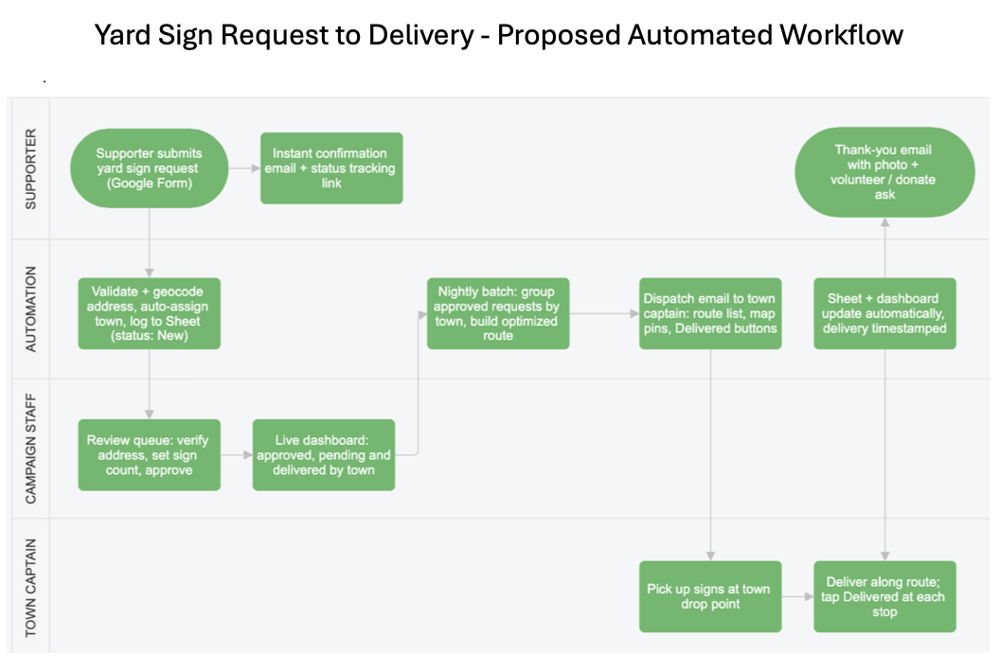

# Background Brief: Committee to Elect Jessica Bradley Rushing

Mukhtar Ali and Kimmie Whicher · AI and Civil Society · October 1, 2026

*The Word original is [Rushing Background Brief.docx](Rushing%20Background%20Brief.docx).*

## 1. What the organization does

The Committee to Elect Jessica Bradley Rushing is the organization that is supporting Jessica Rushing’s Campaign as the Democratic nominee for State Representative in the 6th Plymouth District. The district covers all of Duxbury and parts of Halifax, Hanson, Marshfield and Pembroke (malegislature.gov). She faces Republican incumbent Ken Sweezey on November 3 (MA Secretary of State).

The seat is close and Democrat Josh Cutler won it in 2012, the first Democrat to hold it since Reconstruction, and kept it until 2024 (Wikipedia). Sweezey then won the open seat 52.9% to 47.0% (Ballotpedia). The Democrat carried Duxbury and the Marshfield precinct but lost the other towns (Duxbury Clipper). Turnout in Halifax, Hanson and Pembroke will likely decide this race.

Jessica is running to push for reform at the state level and bring more state resources back to these towns. If she wins, she will be the first woman to represent the district (LinkedIn). VoteVets, Moms Demand Action and the Massachusetts Women's Political Caucus PAC have endorsed her (electjbr.com, MWPC). 

## 2. Who runs it

Jessica runs the campaign with a campaign manager and volunteers organized by town captains. The campaign is small and runs lean. The committee organized in March 2026. As of its September 30 deposit report, it had raised $39,356 this year, spent $22,626, and had $17,395 on hand. Sweezey has raised less this year, $22,060, but has more cash on hand, $24,532, carried over from earlier cycles (OCPF, Rushing Committee). Five weeks out, every dollar Jessica spends on tools is a dollar not spent on voters.

## 3. What the work looks like day to day

Three tasks take most of the campaign's time. Jessica spends most weekends knocking doors. Staff and volunteers host phone and text banks. And the campaign handles yard sign requests, which run like this:

- Staff share a QR code that links to a Google Form.
- A supporter fills out the form.
- The response lands in a Google Sheet.
- Staff review each request and send it to the town captain.
- The captain delivers the sign.
- After the election, volunteers pick the signs back up.

(From our conversation with Jessica Rushing on September 9, 2026.)

## 4. Where AI already shows up

It doesn't yet and Jessica is open to trying it. (From our conversation with Jessica Rushing on September 9, 2026.)

## 5. Frictions worth a closer look

The spreadsheet keeps records but gives no insight. It logs the name and address of sign requestors but it can't show Jessica where signs are on the ground or which towns are thin. In a race likely decided outside Duxbury, that's the view she needs to decide where to push. One of the staff's friction points is that the busy campaign manager must manually and iteratively dispatch locations for sign deliveries to the correct volunteer captain, then the volunteers drive from place to place delivering signs. The volunteers however lose time by driving across town numerous times, instead of having a recommended route that’s optimal for time and fuel consumption.

Pickup has no plan. Signs must come down within 48 hours of the election [cite the rule, and check whether it's state law or a town bylaw in each of the five towns]. Nothing in the current process gives captains a pickup list. Jessica wants a better way to do it.

(From our conversation with Jessica Rushing on September 9, 2026.)

---

